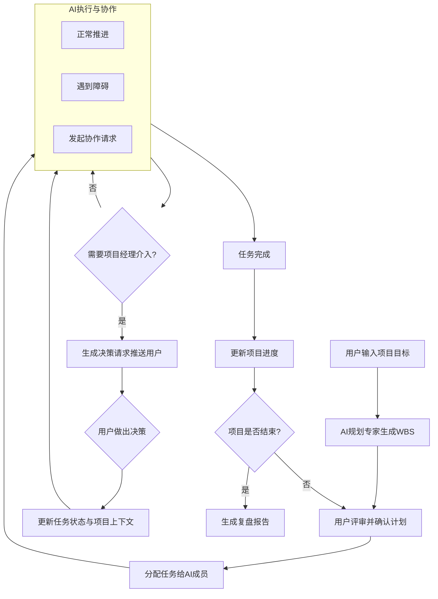

# funpmp - AI 项目管理模拟训练系统

> 🎮 一个基于 AI 智能体的项目管理"飞行模拟器"

---

## 项目简介

**funpmp** 是一个创新的 AI 驱动项目管理实训系统，为项目经理和项目管理学习者提供了一个安全、可控的训练环境。在这个系统中，你扮演项目经理的角色，与多个具有专业知识和独立决策能力的 AI 智能体协作完成项目。

### 核心设计理念

**"人类项目经理驱动决策，AI 智能体负责执行与推演"**

这不是一个简单的任务管理工具，而是一个**动态的项目管理模拟器**。AI 智能体像真实的团队成员一样：
- 🤖 具备专业领域的知识和判断能力
- ⚠️ 主动报告遇到的问题和风险
- 💬 提出多种解决方案供你选择
- 🔄 模拟真实的团队协作场景和冲突

### 应用场景

- **项目经理培训** - 在零风险环境中练习决策能力
- **团队协作模拟** - 体验跨角色沟通与协调
- **敏捷流程演练** - 理解迭代、站会、回顾等实践
- **风险应对训练** - 学会识别和应对项目风险

---

## 功能特性

### 核心功能

| 功能 | 描述 |
|------|------|
| 🤖 **多智能体协作** | 规划专家、前端开发、后端开发、项目经理等角色各司其职 |
| 📋 **WBS 任务分解** | AI 规划专家自动生成工作分解结构 |
| 🎯 **任务分配管理** | 支持将任务分配给不同 AI 团队成员 |
| ⚠️ **事件模拟引擎** | 阻塞事件、依赖冲突、技术风险等真实场景 |
| 🔴 **决策请求系统** | AI 智能体遇到问题时生成结构化的决策请求 |
| 📊 **项目状态看板** | 实时显示任务状态、进度和决策请求 |
| 💬 **命令行交互** | 简洁直观的 CLI 界面 |

### 项目管理专业功能

- 📈 **挣值管理（EVM）** - 支持 PV、EV、AC、SV、SPI、CV、CPI 等指标计算
- ⏱️ **工期估算** - 基于三点估算法（PERT）的工期计算
- 📝 **决策记录** - 记录所有关键决策点及选择结果
- 📊 **项目复盘报告** - 自动生成包含经验总结的最终报告

---

## 技术栈

### 后端核心
- **Python 3.10+** - 主要开发语言
- **LangGraph** - 构建 AI 智能体工作流
- **LangChain (OpenAI)** - LLM 集成与智能体能力
- **Pydantic** - 数据模型验证

### 依赖库
```
langchain-community  - LangChain 社区扩展
langchain-openai     - OpenAI 模型集成
langgraph            - 智能体工作流框架
python-dotenv        - 环境变量管理
```

### 计划扩展
- **SQLModel** - 数据持久化
- **FastAPI** - REST API 服务
- **React/Vue** - Web 前端界面

---

## 快速开始

### 环境要求

- Python 3.10 或更高版本
- OpenAI API 密钥（或兼容的 API）
- pip 或 uv 包管理器

### 安装步骤

```bash
# 1. 克隆仓库
git clone https://github.com/your-username/funpmp.git
cd funpmp

# 2. 创建虚拟环境（推荐）
python -m venv .venv
source .venv/bin/activate  # Linux/Mac
# 或
.venv\Scripts\activate     # Windows

# 3. 安装依赖（推荐使用 uv）
uv sync
# 或使用 pip
pip install -r requirements.txt
```

### 配置

创建 `.env` 文件并设置 OpenAI API 密钥：

```bash
# .env
OPENAI_API_KEY=your-api-key-here
OPENAI_API_BASE=https://api.openai.com/v1  # 可选，用于自定义 API 端点
OPENAI_MODEL=gpt-3.5-turbo                  # 可选，默认模型
LLM_TEMPERATURE=0.7                          # 可选，LLM 温度参数
```

### 运行

```bash
# 启动项目管理模拟器
python funpmp.py
```

---

## 核心流程

funpmp 的工作流程模拟了真实项目的推进过程：



### 阶段说明

#### 1. 项目启动与规划
- 用户输入项目目标和范围
- AI 规划专家生成 WBS（工作分解结构）
- 用户评审并确认计划

#### 2. 任务分配与执行
- 将任务分配给不同的 AI 团队成员
- AI 成员开始"工作"，系统模拟执行时间
- 执行过程中会触发各种项目事件

#### 3. 事件与决策
- **阻塞事件**：技术不兼容、依赖未完成等
- **协作事件**：前后端接口约定、方案评审等
- **进度事件**：任务复杂度超出预期等

#### 4. 项目收尾
- 所有任务完成后生成复盘报告
- 包含原始计划 vs 最终结果对比
- 关键决策点回顾和经验总结

---

## 项目结构

```
funpmp/
├── main.py              # 简单的入口文件
├── funpmp.py            # 核心 AI 智能体系统实现 (800+ 行)
│   ├── ProjectManagementAgents   # 智能体系统类
│   ├── ProjectState              # 项目状态管理
│   └── ProjectManagerSimulator   # 命令行交互界面
├── ev.py                # 挣值管理计算函数
├── worktime.py          # 工期估算函数 (PERT 三点估算)
├── spec.md              # 详细的产品规格说明
├── CLAUDE.md            # Claude Code 开发指南
├── requirements.txt     # 项目依赖列表
└── pyproject.toml       # 项目配置文件
```

### 核心类说明

| 类名 | 功能描述 |
|------|----------|
| `ProjectManagementAgents` | 管理 AI 智能体团队和工作流 |
| `ProjectState` | 维护项目状态、任务列表、决策请求 |
| `ProjectManagerSimulator` | 提供命令行交互界面和状态可视化 |

### 数据结构

- **TaskStatus** - 任务状态枚举（待办、进行中、已阻塞、已完成）
- **AgentType** - 智能体类型枚举（规划专家、前端开发、后端开发、项目经理）
- **Task** - 任务对象（ID、标题、描述、状态、分配人等）
- **DecisionRequest** - 决策请求（任务ID、发起人、问题、选项）

---

## 使用示例

### 示例一：完整项目流程

```
$ python funpmp.py

🚀 AI项目管理实训系统 (基于LangGraph)
========================================
请输入项目目标: 开发一个用户登录功能

============================================================
📋 AI项目管理实训系统 - 当前状态
============================================================

🎯 项目目标: 开发一个用户登录功能

👥 当前执行者: 项目经理

📝 任务看板:

  待办:
    1. 数据库设计 - [未分配]
    2. 后端API开发 - [未分配]
    3. 前端页面开发 - [未分配]
    4. 联调与测试 - [未分配]

...

🔴 需要您的决策 (共1个待处理):

决策 1: 来自 后端开发
问题: 在开发登录接口时，我需要明确知道前端传递登录数据的格式，以及期望后端返回的响应体格式。没有这个约定，我无法继续编码。
选项:
  1. 请前端开发优先输出一份正式的接口文档
  2. 我可以先按照惯例定义一份草案，交由前端确认后再开发

请选择 (输入选项编号): 2

📄 后端开发已生成API草案:
        【API草案】
        - 请求：POST /api/login, Body: { "email": "string", "password": "string", "rememberMe": "boolean" }
        - 响应：{ "code": 200, "message": "success", "data": { "token": "xxx", "userInfo": { ... } } }
```

### 示例二：挣值管理计算

```python
# ev.py
def ev_cal(pv, ac, ev):
    """计算挣值管理指标"""
    sv = ev - pv      # 进度偏差
    spi = ev / pv     # 进度绩效指数
    cv = ev - ac      # 成本偏差
    cpi = ev / ac     # 成本绩效指数
    return sv, spi, cv, cpi

# 使用示例
sv, spi, cv, cpi = ev_cal(pv=800, ac=1000, ev=700)
print(f"进度偏差: {sv}, 进度绩效: {spi}")
print(f"成本偏差: {cv}, 成本绩效: {cpi}")
```

### 示例三：工期估算（三点估算法）

```python
# worktime.py
def fit(best, possible, bad):
    """PERT 三点估算法"""
    return (best + 4 * possible + bad) / 6

# 使用示例：最优 12 天，最可能 10 天，最坏 7 天
estimate = fit(12, 10, 7)
print(f"估算工期: {estimate} 天")
```

---

## 开发指南

### 添加新的 AI 智能体

```python
# 1. 在 AgentType 枚举中添加新类型
class AgentType(Enum):
    PLANNER = "规划专家"
    FRONTEND_DEV = "前端开发"
    BACKEND_DEV = "后端开发"
    TESTER = "测试专家"  # 新增

# 2. 创建智能体方法
def _create_tester_agent(self):
    tools = [
        Tool(name="test_task", func=self._test_task_tool, ...),
        Tool(name="report_bug", func=self._report_bug_tool, ...),
    ]
    return create_react_agent(self.llm, tools)

# 3. 在工作流中添加节点
workflow.add_node("tester", self._tester_node)

# 4. 添加路由逻辑
def _route_after_developer(self, state):
    # 返回 "tester" 路由到测试节点
```

### 添加新工具

工具函数命名格式：`_action_tool`，接收字符串参数，返回字符串结果。

```python
def _my_new_tool(self, param: str) -> str:
    """新工具的描述"""
    # 工具逻辑
    return "执行结果"
```

### 代码规范

- 所有 Python 文件必须以 `# -*- coding: utf-8 -*-` 开头
- 数据结构尽可能使用强类型（dataclass、BaseModel）
- 单个文件建议不超过 300 行（核心模块除外）
- 使用中文进行注释和文档

---

## 常见问题

### Q: 提示 "未设置有效的 OpenAI API 密钥"

确保在 `.env` 文件中正确设置了 `OPENAI_API_KEY`，或者设置环境变量：

```bash
export OPENAI_API_KEY="your-api-key"
```

### Q: 支持使用其他 LLM 提供商吗？

支持！通过设置 `OPENAI_API_BASE` 环境变量，可以使用兼容 OpenAI API 的其他服务。

### Q: 如何调整 AI 智能体的行为？

可以通过修改 `LLM_TEMPERATURE` 参数来调整 AI 的创造性（0-1 之间，越高越随机），或直接修改智能体的提示词。

### Q: 项目支持数据库持久化吗？

当前 MVP 版本使用内存存储。计划在后续版本中通过 SQLModel 支持数据库持久化。

---

## 开发路线图

- [x] MVP 版本 - 基础多智能体协作
- [ ] Web 界面 - 替换命令行界面
- [ ] 数据持久化 - 支持项目保存与加载
- [ ] 更多智能体角色 - 产品经理、UI 设计师、运维等
- [ ] 复杂事件剧本 - 核心成员离职、需求变更等
- [ ] 多人协作模式 - 支持多个用户同时参与
- [ ] AI 决策分析 - 对用户决策进行评分和建议

---

## 许可证

MIT License

---

## 贡献

欢迎提交 Issue 和 Pull Request！

---

## 联系方式

如有问题或建议，请通过以下方式联系：

- 提交 Issue: [GitHub Issues](https://github.com/your-username/funpmp/issues)
- 邮箱: your-email@example.com
