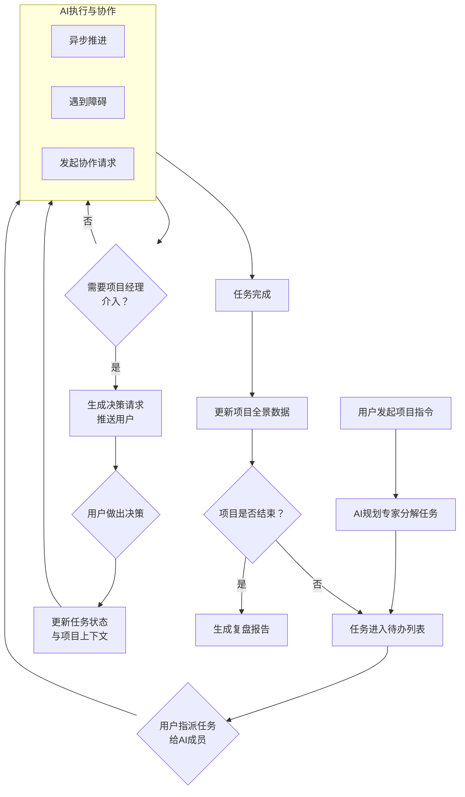
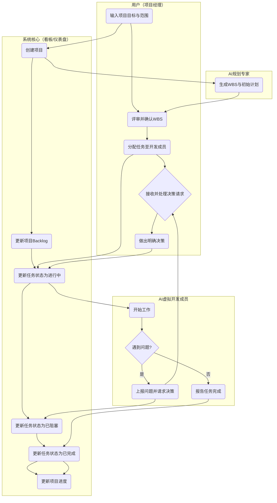

非常好！作为精通AI的产品经理，我非常理解这个项目的核心：**它不是一个简单的任务管理工具，而是一个模拟真实项目环境下，人类项目经理与多个AI智能体协同工作的“训练场”。**

核心设计理念是：**“人类项目经理驱动决策，AI智能体负责执行与推演”。** 用户（项目经理）是大脑和指挥官，AI智能体是高效、专业但需要被管理的四肢和器官。

---

### 一、核心角色定义

1.  **用户（人类项目经理）**
    *   **角色**：决策者、协调者、风险应对者、最终负责人。
    *   **核心能力**：目标制定、优先级判断、资源权衡、人际沟通、关键决策。

2.  **AI智能体团队（模拟项目成员）**
    *   **角色**：执行者、专家顾问、信息提供者、风险预警者。
    *   **核心能力**：专业领域知识、高效执行、数据分析、模拟沟通。
    *   **建议的智能体角色**：
        *   **规划专家**：协助进行WBS分解、估算工时、识别依赖。
        *   **技术负责人**：评估技术方案、识别技术风险、模拟代码/设计产出。
        *   **质量保证专家**：制定测试策略、报告缺陷、评估质量风险。
        *   **运营/市场代表**：提供用户反馈、市场数据，验收功能。
        *   **虚拟团队成员（多个）**：模拟执行具体任务，会“遇到问题”、产生“情绪波动”、需要“沟通”。

---

### 二、协作推进的业务逻辑（核心流程）

整个系统运行在一个**事件驱动**的循环中，其核心业务流程可以概括为以下环路：

下面，我们来详细拆解这个流程中的每一个关键环节。

#### 阶段一：项目启动与规划（“运筹帷幄”）

1.  **用户输入**：用户（项目经理）输入项目目标、范围、初始需求、关键里程碑。
2.  **AI协作**：
    *   **规划专家**启动，与用户对话，澄清需求，输出初步的**WBS（工作分解结构）**、**里程碑计划**和**关键依赖**。
    *   **技术负责人**和**质量保证专家**介入，对WBS中的技术任务和测试任务进行评审，补充细节，并初步识别**技术风险**。
    *   **用户**对AI生成的计划进行**评审、调整和确认**。这是关键决策点。

#### 阶段二：任务执行与模拟（“战场推演”）

1.  **任务分配**：用户在Backlog中，将任务拖拽分配给不同的**虚拟AI团队成员**。
2.  **AI执行**：
    *   AI成员开始“工作”，系统根据任务复杂度、成员能力属性，**模拟一个执行时间**（例如，一个8人天的任务，在快进模式下可能几分钟内状态更新为“完成”）。
    *   **核心逻辑**：执行过程不是一帆风顺的。系统会根据预设的“**项目不确定性因子**”和任务属性，随机或按剧本触发**事件**。
3.  **事件类型**：
    *   **阻塞事件**：技术负责人报告：“发现所选框架与第三方服务不兼容，需要变更技术方案。”
    *   **依赖事件**：A成员说：“我需要的接口文档，B成员还没有给我，我被迫阻塞。”
    *   **风险事件**：质量保证专家预警：“由于需求频繁变更，测试用例维护工作量激增，原定测试时间可能不够。”
    *   **沟通事件**：虚拟成员C和D在同一个任务上产生“分歧”，需要项目经理协调。
    *   **进度事件**：虚拟成员报告：“任务比预想复杂，预计要延期2天。”

#### 阶段三：人类介入与决策（“指挥官时刻”）

1.  **决策请求**：当AI触发一个需要项目经理介入的事件时，系统会向用户推送一个**清晰的决策请求**。
    *   **背景**：发生了什么问题。
    *   **AI分析**：相关AI（如技术负责人）会提供1-3个解决方案选项，并分析每个方案的**Pros/Cons**。
    *   **影响评估**：系统会量化每个方案对**进度、成本、质量、范围**的影响（例如：方案A会导致延期2天，方案B需要增加1个成员）。
2.  **用户决策**：用户需要做出选择。
    *   例如，对于“技术不兼容”问题，用户可以选择：
        *   A. 投入资源研发适配层（保进度，增成本）。
        *   B. 更换技术方案（保质量，增风险，可能延期）。
        *   C. 削减某个次要功能（保核心进度）。
3.  **反馈循环**：用户的决策会立刻更新项目状态。
    *   选择A，则生成一个新的“研发适配层”任务。
    *   选择B，则技术负责人重新评估，并可能标记后续任务为“高风险”。
    *   选择C，则运营代表可能会提出异议，需要用户去沟通。

#### 阶段四：监控、调整与收尾

1.  **全景仪表盘**：用户始终有一个文本格式的仪表盘，显示：
    *   **文本燃尽图**、**迭代进度**。
    *   **风险雷达图**：动态显示各个维度（进度、成本、技术、资源）的风险等级。
    *   **团队状态**：模拟显示团队成员的工作负荷、士气（受决策和事件影响）。
2.  **主动干预**：用户可以不等待事件触发，主动进行：
    *   **召集站会**：系统模拟生成各AI成员昨日进展、今日计划、遇到问题。
    *   **发起评审**：要求对某个关键交付物进行评审。
    *   **调整资源**：将某个成员从低优先级任务调到高优先级阻塞任务。
3.  **项目收尾**：
    *   当所有任务完成，**运营代表**会进行“验收”，并给出模拟的用户反馈。
    *   系统生成**项目复盘报告**，包括：原始计划 vs 最终结果、关键决策点回顾、风险应对总结、团队效能数据等。这是**实训系统的价值核心**，帮助用户反思学习。

---

### 三、关键AI技术与数据结构

1.  **智能体架构**：
    *   **记忆体**：每个AI智能体有自己的角色设定、专业知识库和单次会话内的对话记忆。
    *   **决策引擎**：完全基于LLM动态生成，提供高度智能的决策建议和问题分析。
    *   **状态机**：每个任务、每个AI成员都有状态（待办、进行中、阻塞、待评审、完成等）。

2.  **项目上下文**：
    *   维护一个统一的**项目事实数据库**，包括：项目目标、范围、计划、当前进度、已识别风险、关键决策历史、团队沟通记录。所有AI智能体都基于这个统一的上下文进行交互，避免“精神分裂”。

3.  **事件生成模型**：
    *   **基于规则的触发器**：例如，任务延期超过阈值自动触发风险事件。
    *   **基于概率的随机事件**：根据“项目健康度”动态调整事件发生概率。
    *   **基于剧本的关键事件**：为了教学目的，系统可以内置一些经典项目困境剧本（如“核心成员离职”、“甲方突然变更核心需求”）。

---

## Clarifications

### Session 2025-10-11

- Q: 技术实现栈选择 → A: 明确具体技术栈（如Python+FastAPI+React），确保团队一致性
- Q: AI智能体决策复杂度 → A: 完全基于LLM动态生成（高度智能）
- Q: 项目时间模拟比例 → A: 1分钟模拟 = 1天项目时间（快速演示）
- Q: 用户界面复杂度 → A: 纯命令行界面（简单快速）
- Q: AI智能体记忆持久化 → A: 单次会话内记忆（简单）

### 四、MVP（最小可行产品）版本建议

1.  **核心角色**：用户 + 1个规划专家 + 2个虚拟开发成员。
2.  **技术栈明确**：Python + FastAPI + LangChain + OpenAI，React前端（如需扩展）
3.  **AI决策引擎**：完全基于LLM动态生成，提供高度智能的决策建议
4.  **时间模拟**：1分钟模拟 = 1天项目时间，支持快速演示和训练
2.  **核心流程**：用户输入目标 -> 规划专家生成简单WBS -> 用户分配任务 -> 模拟执行 -> 触发1-2种简单阻塞事件（如“依赖未完成”、“技术难题”） -> 用户决策 -> 项目完成。
5.  **核心界面**：纯命令行界面，通过终端进行项目管理交互
6.  **记忆管理**：AI智能体采用单次会话内记忆，保证训练过程连贯性

通过这个设计，我们创造的不是一个冰冷的工具，而是一个充满动态、挑战和学习机会的**项目管理的“飞行模拟器”**。用户在其中锻炼的不是点按钮，而是在复杂、不确定的环境中做出权衡决策的肌肉记忆。

### MVP泳道图说明

**泳道角色：**
*   **用户（项目经理）：** 系统的驱动者和决策者。
*   **系统核心（看板/仪表盘）：** 项目状态的单一事实来源，负责可视化展示和状态更新。
*   **AI规划专家：** 负责项目启动和任务分解。
*   **AI虚拟开发成员（前端开发 & 后端开发）：** 负责执行具体任务，并模拟工作中遇到的问题。

**核心流程：**
下图详细描述了从项目启动到任务完成，包括正常流程和异常处理的全过程。

---

### 泳道图流程详解

| 阶段 | 用户（项目经理） | 系统核心（看板/仪表盘） | AI规划专家 | AI虚拟开发成员 |
| :--- | :--- | :--- | :--- | :--- |
| **1. 项目启动** | **输入项目目标与范围** 例如："开发一个用户登录功能" | **创建项目**，初始化看板和数据 | | |
| | | 触发**AI规划专家**启动 | | |
| **2. 任务规划** | | | **生成WBS与初始计划** （例如：分解为 1. 数据库设计 2. 后端API开发 3. 前端页面开发） | |
| | **评审并确认WBS** （用户可进行微调） | **更新项目Backlog** （将确认的任务列入待办列表） | | |
| **3. 任务分配与执行** | **分配任务** （将任务拖拽分配给 "前端"或"后端"开发成员） | **更新任务状态** （从"待办" -> **"进行中"**） | | **开始工作** （系统开始模拟执行时间） |
| **4. 异常处理（核心协作点）** | | | | **{遇到问题?}**  （系统根据逻辑判定，例如: 后端依赖前端的接口定义） |
| | | | | **→ 是: 上报问题并请求决策** （例如:"我需要前端的接口 定义才能继续，目前被阻塞。"） |
| | | **更新任务状态** （从"进行中" -> **"已阻塞"**） 并在看板上高亮显示 | | |
| | **接收并处理决策请求** （系统通过弹窗或消息通知用户） | | | |
| | **做出明确决策** （例如:"要求前端开发 先输出接口文档"） | | | |
| | | **更新任务状态** （从"已阻塞" -> **"进行中"**） | | |
| **5. 任务完成** | | | | **→ 否: 报告任务完成** |
| | | **更新任务状态** （从"进行中" -> **"已完成"**） | | |
| | | **更新项目进度** （例如: 燃尽图下滑） | | |

---

### MVP的关键交互设计要点

1.  **决策请求的呈现形式**：
    *   当AI成员上报问题时，系统应给用户一个**强提醒**（如弹窗）。
    *   内容模板为：【**决策请求**】【来自：后端开发】【关联任务：用户登录API开发】
        *   **问题描述**：我需要前端的接口定义（请求/响应格式）才能开始编码，但目前没有。
        *   **建议方案**：
            *   方案A：要求前端开发暂停当前工作，优先提供接口文档。
            *   方案B：我根据经验先假设一个格式进行开发，后续再调整。
        *   **请做出选择**： [ 按钮：方案A ] [ 按钮：方案B ]

2.  **看板状态可视化**：
    *   **颜色区分**："已阻塞"的任务用红色突出显示。
    *   **信息悬浮**：鼠标悬停在任务上，可看到执行者、创建时间、阻塞原因等关键信息。

3.  **聊天窗口作为补充**：
    *   除了看板，提供一个与所有AI智能体的**统一聊天界面**。
    *   用户可以在任何时候主动询问："前端开发，你的进度如何？" 系统会模拟生成一个进度报告。

这个MVP泳道图清晰地定义了最小范围的协作逻辑，实现了 **“规划 -> 执行 -> 阻塞 -> 决策 -> 推进”** 的核心闭环，为后续迭代扩展更多AI角色和复杂事件打下了坚实基础。